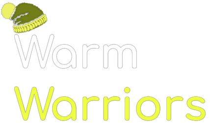

Warm Warriors is a web app developed to allow students to find their way around the various buildings on the uWaterloo campus using only the tunnels, bridges and connections that exist between buildings.

In other words, Warm Warriors allows a student to travel across campus without having to deal with harsh Canadian winters 🥶 .

### The Frontend:

The app itself was built using React.js and the Material UI library. The results (i.e. the path) is displayed as a list of cards, with each card flipping when the mouse hovers over it. The images on the back of the cards are pulled from publicly availible [floor plans from uWaterloo.](https://uwaterloo.ca/plant-operations/floor-plans)

An example of a card with data from uWaterloo floor plans

### The Backend:

The backend API was built using Node.js and the Express.js library. MongoDB Atlas was used for the database and to store connections between buildings. Given the codes of two buildings on campus, the server first checks the cache to see if that result has been previously computed. If not, it performs Breadth-First search until it finds a path and returns that to the client, storing the result in the database to save computational time on future references.

### Tech Stack

**Client:** React, Material UI

**Server:** Node.js, Express.js, MongoDB Atlas, Azure

### Demo:
A demonstration of the app finding a path from PAC to E5: 
(my daily commute on this path was the inspiration for this project!) 

